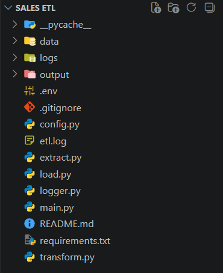
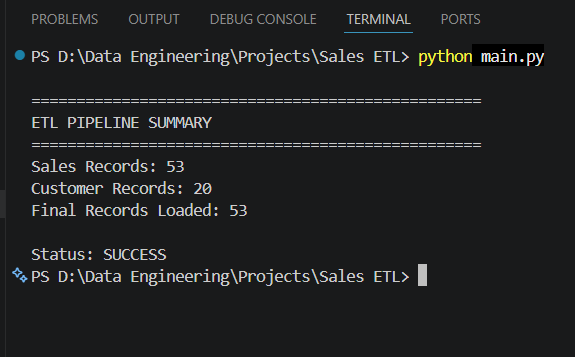
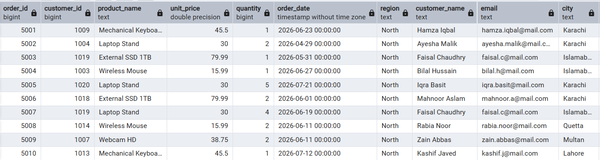
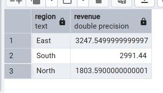
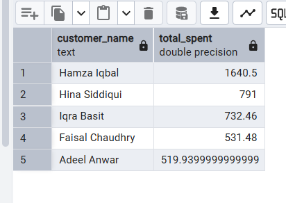
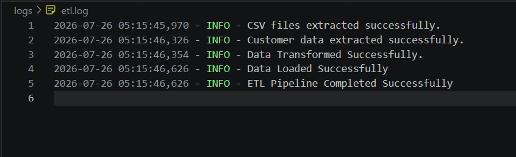

# 🚀 Sales ETL Pipeline using Python & PostgreSQL


---

# 📌 Project Overview

This project demonstrates an end-to-end **ETL (Extract, Transform, Load)** pipeline built using **Python** and **PostgreSQL**.

The pipeline extracts sales data from multiple CSV files and customer information from a PostgreSQL database, performs data validation and feature engineering, and loads the transformed data into PostgreSQL for reporting and analysis.

The project follows a modular ETL architecture where each stage (Extract, Transform, and Load) is implemented independently to improve maintainability and scalability.

---

# 🎯 Objectives

- Extract data from multiple sources
- Clean and validate data
- Merge datasets using a common key
- Generate business metrics
- Load transformed data into PostgreSQL
- Maintain logs and error handling
- Build a reusable ETL pipeline

---

# 🏗 ETL Architecture

```text
                 CSV Files
        ┌──────────┬──────────┬──────────┐
        │ North    │ South    │ East     │
        └─────┬────┴─────┬────┴─────┬────┘
              │          │          │
              └──────────┴──────────┘
                         │
                    Extract Layer
                         │
                         ▼
                Data Validation
                         │
                         ▼
                Data Transformation
                         │
                         ▼
               Feature Engineering
                         │
                         ▼
                PostgreSQL Database
                         │
                         ▼
             sales_customer_fact Table
```

---

# 📂 Project Structure

```text
Sales_ETL_Project/

│
├── data/
│   ├── sales_north.csv
│   ├── sales_south.csv
│   └── sales_east.csv
│
├── logs/
│   └── etl.log
│
├── output/
│   └── final_sales_data.csv
│
├── extract.py
├── transform.py
├── load.py
├── logger.py
├── config.py
├── main.py
│
├── requirements.txt
├── .env
├── .gitignore
└── README.md
```

---

# 📊 Data Sources

## Source 1 — CSV Files

Three CSV files containing sales transactions:

- sales_north.csv
- sales_south.csv
- sales_east.csv

Columns:

- order_id
- customer_id
- product_name
- unit_price
- quantity
- order_date
- region

---

## Source 2 — PostgreSQL

Database:

```
sales_etl_project
```

Table:

```
customers
```

Columns:

- customer_id
- customer_name
- email
- city
- signup_date
- membership_tier

---

# 🔄 ETL Process

## Extract

- Read multiple CSV files
- Read customer data from PostgreSQL
- Combine all sales datasets

---

## Transform

The following transformations are performed:

- Data inspection
- Missing value validation
- Duplicate detection
- Date conversion
- Merge datasets using customer_id
- Calculate Total Sale
- Generate Order Month
- Generate Order Year
- Calculate Customer Tenure
- Data validation

---

## Load

The transformed dataset is:

- Saved as CSV
- Loaded into PostgreSQL

Target Table:

```
sales_customer_fact
```

---

# 📈 Feature Engineering

The following business columns are generated:

| Column | Description |
|---------|-------------|
| total_sale | unit_price × quantity |
| order_month | Month extracted from order_date |
| order_year | Year extracted from order_date |
| customer_tenure_days | Number of days between signup and purchase |

---

# 🛠 Technologies Used

- Python
- Pandas
- PostgreSQL
- SQLAlchemy
- psycopg2
- Logging
- python-dotenv

---

# 🧪 Data Validation

The pipeline validates:

- Missing Values
- Duplicate Records
- Data Types
- Merge Consistency

---

# 📄 Output

The ETL pipeline generates:

### PostgreSQL

```
sales_customer_fact
```

### CSV Output

```
output/final_sales_data.csv
```

### Logs

```
logs/etl.log
```

---

# 🚀 How to Run

## Clone Repository

```bash
git clone https://github.com/Mustafa-Akhlaq/Sales_ETL_Pipeline.git
```

---

## Install Dependencies

```bash
pip install -r requirements.txt
```

---

## Configure Environment Variables

Create a `.env` file:

```text
DB_HOST=localhost
DB_PORT=5432
DB_NAME=sales_etl_project
DB_USER=postgres
DB_PASSWORD=your_password
```

---

## Run Pipeline

```bash
python main.py
```

---

# 📊 Example SQL Queries

## Total Revenue

```sql
SELECT SUM(total_sale)
FROM sales_customer_fact;
```

---

## Revenue by Region

```sql
SELECT
    region,
    SUM(total_sale) AS revenue
FROM sales_customer_fact
GROUP BY region
ORDER BY revenue DESC;
```

---

## Revenue by Membership Tier

```sql
SELECT
    membership_tier,
    SUM(total_sale) AS revenue
FROM sales_customer_fact
GROUP BY membership_tier
ORDER BY revenue DESC;
```

---

## Top 5 Customers

```sql
SELECT
    customer_name,
    SUM(total_sale) AS total_spent
FROM sales_customer_fact
GROUP BY customer_name
ORDER BY total_spent DESC
LIMIT 5;
```

---

## Best Selling Products

```sql
SELECT
    product_name,
    SUM(quantity) AS units_sold
FROM sales_customer_fact
GROUP BY product_name
ORDER BY units_sold DESC;
```

---

# 📷 Sample Output

```text
✓ CSV files extracted successfully

✓ Customer data extracted successfully

✓ Data transformed successfully

✓ Data loaded into PostgreSQL

✓ Output CSV generated

✓ ETL logs generated

ETL Pipeline Completed Successfully!
```

---

# 📸 Project Screenshots

## 📁 Project Structure



---

## ▶️ ETL Pipeline Execution



---

## 🐘 PostgreSQL - sales_customer_fact Table



---

## 📊 SQL Query Results




---

## 📝 ETL Log File



---

# 🔐 Logging & Error Handling

The pipeline includes:

- Centralized logging
- Exception handling
- Error reporting
- ETL execution logs

Log File:

```
logs/etl.log
```

---

# 📌 Future Improvements

- Incremental ETL
- Apache Airflow Scheduling
- Docker Containerization
- Unit Testing
- Data Quality Reports
- Star Schema Implementation
- AWS S3 Integration
- Apache Spark for Large Datasets

---

# 👨‍💻 Author

**Mustafa Akhlaq**

BS Software Engineering  
University of Karachi

### Connect with Me

- GitHub: https://github.com/Mustafa-Akhlaq
- LinkedIn: www.linkedin.com/in/mustafa-akhlaq-0ba7942b9

---

# ⭐ If you found this project useful, consider giving it a star!